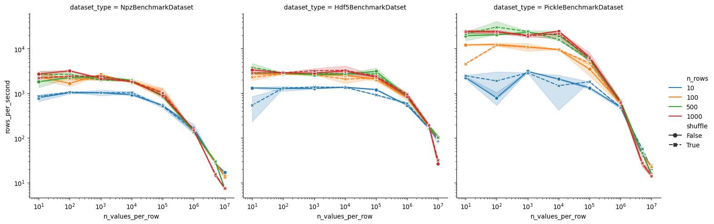

# DatasetBenchmark
This benchmark is meant to quickly compare different file formats for storing datasets in python.
Therefore the default values for the benchmark are set so that the benchmark can be run in less than one hour.
For more elaborate benhmarks covering a wider range of parameters the reader should play around with the parameters in the jupyter notebooks.
Often it is not necessary to optimize the performance of dataloading but in some cases it can be crucial.
The results can be heavily influenced by the used hardware.
Therefore the benchmark should be run on the intended target hardware to get a feeling for how important the choice of file format is.

## Assumptions
A main assumption in this benchmark is that the dataset is too large to fit into memory.
If the dataset fits into memory the choice of file format is not that important as the data can be loaded into memory in a few seconds.
Another assumoption is that the number of columns has no significant influence on the loading time except for the size of the datapoint.
Also the format of the data is assumed to have no effect on the loading time.
Thus it is asssumed that only the number of bytes per datapoint has an effect on the loading time.

## Bringing the values into perspective
A HD-image has a size of 1920x1080x3=6.220.800 values.
The benchmark assumes 8 byte floating point values.
However images can also be stored as 1 byte integer values (0-255).
This would be equivalent to 777.600 floating point values.
Reducing the resolution of the images can, obviously, reduce the number of values drastically.

| Size of Image | Number of Images | Number of Values | Equivalent For Integer Values (/8) |
|---------------|------------------|------------------|------------------------------------|
| 480x640       | 1                | 921.600          | 115.200                            |
| 480x640       | 4                | 3.6686.400       | 460.800                            |
| 1920x1080     | 1                | 6.220.800        | 777.600                            |
| 1920x1080     | 4                | 24.883.200       | 3.110.400                          |

## Dataloading Results
This benchmark focusses on loading a number of individual rows from a dataset.
For some formates there might be the option to load chunks resulting in a significant speedup but this is not considered in this benchmark as for random access chunking can no longer be used.

One (suprising) result of this benchmark is that the number of datapoints/rows per second is roughly constant over a wide range of datapoint sizes. Only after the size of a datapoint surpases ~10MB (~1M floating point numbers) the loading time starts to scale linearly with the size of the datapoint. The exact size for when the loading time starts to scale linearly depends on the hardware and the file format. Also the linear scale for loading depends on the hardware and the file format.

Since for ML-applications the main metric we care about is the number of datapoints/rows per second we will summarize only this metric in this README. For other metrics like MB/s or the time it takes to load the whole dataset the reader is referred to the jupyter notebook themselves.

The performance using huggingfaces Arrow based dataset abstraction becomes realy bad for datapointa containing more than ~1000 floating point numbers. This will remain also when setting the feature type to an appropriate format like `Array2D`. Probably the strength of the format only comes to shine for datasets with a much larger number of datapoints which have not big values like multiple images.

### Dell Laptop

### Workstation

### Effect of DataLoader
To benchmark the effect of the DataLoader we use a single dataset with 1000 datapoints and 1_000_000 floating point numbers per datapoint.
Otherwise there are just to many possible combinations of parameters to consider.
For other dataset sizes you should run the benchmark again to test te effects of the DataLoader.

On a Laptop the usefullness of the Dataloader is limited since we cannot utilize multiple workers as this results in frequent crashes.

In general the increasing the number of workers is beneficial up to a certain point. After that the overhead of managing the workers becomes to big and the performance decreases again.

For the batch size the performance is roughly constant over a wide range of batch sizes. Only for very small batch sizes the performance decreases. 

Shufflin seems to have an neglecable effect on the performance.
The `pin_memory` option seems can improve the performance significantly over all ranges of batch sizes and number of workers.

Interstingly using a Dataloader for loading a `HDF5` file is slower than loading the data without a Dataloader.
This might be due to problems with multiprocessing and the HDF5 file format. However even for `num_workers=0` the Dataloader is slower than loading the data without a Dataloader.

## Writing Results
While the formats in this benchmark focus more on fast reading since they are used for ML-applications, writing is also considered.
Writing speeds can especially become important when we record data robot data etc in real time.
There are more dedicated formates for these usecases like ROS-bags and there successors but if one datatype can be used for both reading and writing it is often more convenient.
Therfore depending on the usecase we might be able to opt for a format that is faster for reading but slower for writing.
However to figure out if this is the case we need to benchmark the writing speed as well.

## Filtering Results
While simply using a set of npz files is suprisingly fast for loading all data in the dataset the comparison is a bit unfair.
This is because, filtering data by certain properties of certain columns is not possible without iterating once over the whole dataset.
Also selecting and/or loading only certain column is impossible witohut loading all the data of the row.
In general, working on a dataset based on npz files is very cumbersome due to the fact that there is no easy interface to work with the data.
Filtering can be worked around by implementing a dataset wrapper that initially iterates once over the dataset and stores the indices of the rows that fulfill the filter condition. However, this can be very time consuming.